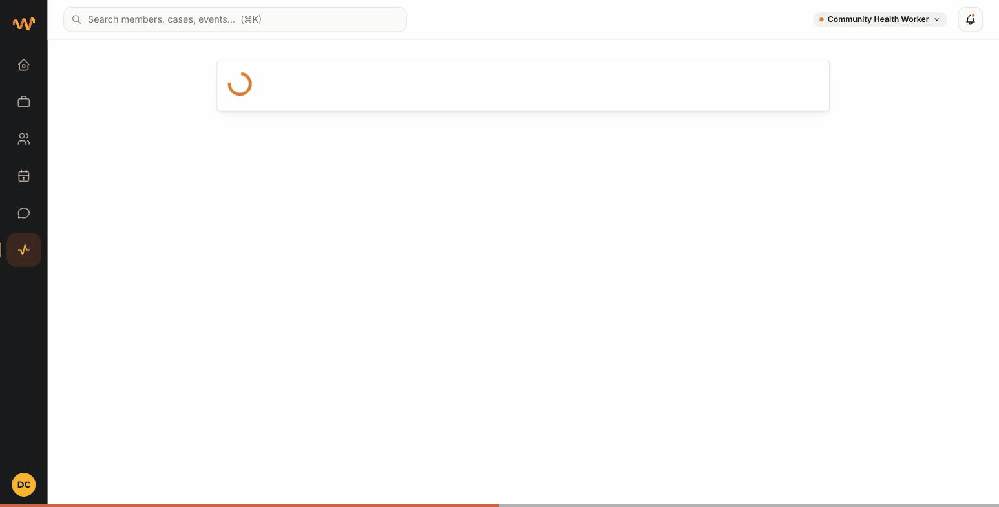
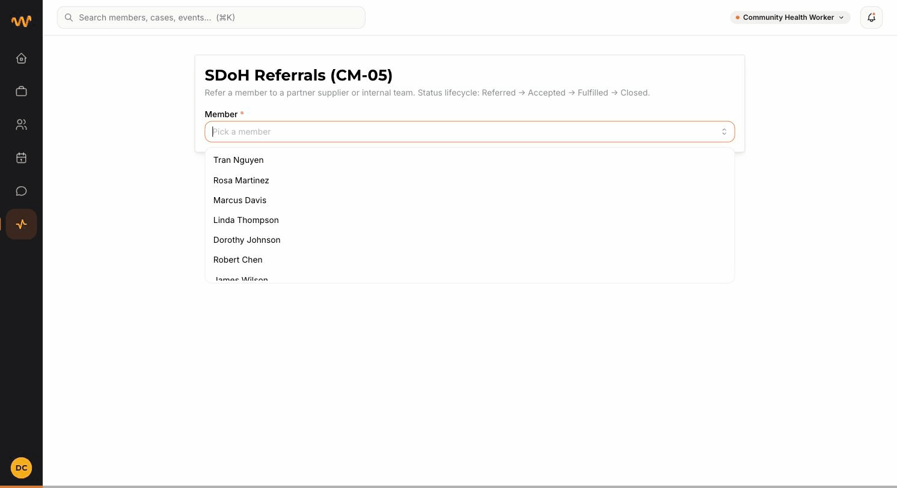

# CM-13 — CHW Workflows

> Spec: [§3.2 CM-13 in the CMS doc](../Unified%20Internal%20Platform/Unified%20Internal%20Platform%20%28CMS%29%2034bb51e686388055bea1feb84c1eb86b.md). Phase 1 / Should — partial implementation in this build (referrals + plan-of-care e-signature shipped; mobile breakpoints + offline sync deferred).

This guide covers the CHW-facing referral workflow that lands on this build. Other CM-13 capabilities (mobile-responsive layout, offline sync, e-sig on Plan of Care acknowledgment) are documented separately or noted as deferred.

---

## How to manage referrals as a CHW

Backed by **CM-05-lite** in the codebase. A referral is a FHIR `Task` with `code=sdoh-referral` and a `businessStatus` carrying the lifecycle: **Referred → Accepted → Fulfilled → Closed**.

### Prerequisites

- Sign in as a user whose active demo role is **Community Health Worker**, **Case Manager**, or **System Admin** (the `referrals.manage` permission). Default test user `spalit+1@widercircle.com` defaults to CHW.
- Active demo role is the badge in the top-right; click it to switch.

### How to reach the page

There are three reach-points:

| From | How |
|---|---|
| Left rail | Click the **Referrals** icon (the activity glyph). It only appears for roles with `referrals.manage`. |
| Direct URL | Open `http://localhost:3001/referrals` |
| Member profile | Open any `/members/:patientId` and click the orange **Refer to supplier** button — this deep-links to `/referrals?patientId=:id` with the member pre-selected. |

The member-page deep link looks like this:

---

## Create, edit (advance status), close, and view

The screen capture below walks through the full lifecycle on member **Marcus Davis**: pick member → fill the new-referral form → click **Create referral** → advance status **Mark Accepted → Mark Fulfilled → Mark Closed**.

### Create

1. Open `/referrals`.
2. Pick the member from the **Member** dropdown. The list is searchable.
3. Once a member is selected the **New referral** card appears with two dropdowns:
   - **Supplier** — partner suppliers (MediCircle, Upside, TruConnect) and Wider Circle internal teams (Case Management, Clinical Staff, Community Events).
   - **Service type** — Food assistance, Housing support, Transportation, Utilities, Pharmacy / medication delivery, Behavioral health, Primary care follow-up, Wireless / connectivity, Other.
4. Optionally type **Notes for supplier** — member context, urgency, contact preferences, language. The notes ship verbatim on the referral; supplier sees them in their queue.
5. Click **Create referral**. A toast confirms `Referral to <supplier> created` and the new referral lands in the **Referral history** card below at status **Referred**.

### Edit (advance the lifecycle)

There is **no free-form edit** of an existing referral's supplier or service type — that's a deliberate scope cut. The available "edits" are status transitions:

- **Mark Accepted** — supplier acknowledged the referral
- **Mark Fulfilled** — service was delivered
- **Mark Closed** — referral terminated (see *Close* below)
- **Mark Referred** — rollback to the initial state if you advanced by mistake

Each row in **Referral history** exposes the buttons that aren't its current state (the current state is the colored badge to the left of the supplier name). Click a status button → toast confirms `Referral marked <state>` → the row's badge updates.

### Close (the delete-equivalent)

There is **no hard delete**. The closest action is **Mark Closed**, which:

- Sets `businessStatus.text = "Closed"` on the underlying `Task`
- Sets the FHIR `Task.status = "cancelled"` (so the supplier's queue stops surfacing it)
- Keeps the row in **Referral history** with the dark `Closed` badge for audit

Audit log retention: the row never disappears. To remove a referral entirely you'd need direct FHIR access — the UI does not expose hard delete.

### View

The **Referral history** card lists all referrals for the selected member, newest first, with:

- Status badge (Referred / Accepted / Fulfilled / Closed) — colored by state
- Supplier name + service type
- Notes (if any) shown beneath
- Authored timestamp top-right
- Lifecycle buttons for any state ≠ current

Switching the **Member** dropdown reloads the history for that member. The page is member-scoped — there is no global "all referrals across members" view in this build (deferred).

---

## What's not covered by this guide (yet)

These pieces of CM-13 exist in this build but are documented elsewhere:

- **E-signature on Plan of Care acknowledgment** — see `/plan-review` (the canvas-based signature pad capture)
- **Field-visit Encounter logging** — on `/members/:patientId` (the "Log field visit" CTA, where present)
- **ECM outreach attempt tracking** — on `/members/:patientId` (the ECM attempts panel)

These pieces of CM-13 are **explicitly deferred**:

- Mobile-responsive breakpoints on the WC shell (the 72px rail is desktop-only today)
- Offline sync (no service worker / IndexedDB queue / sync-batch endpoint)
- Real-time sync (writes are submit-only, not push-driven)
